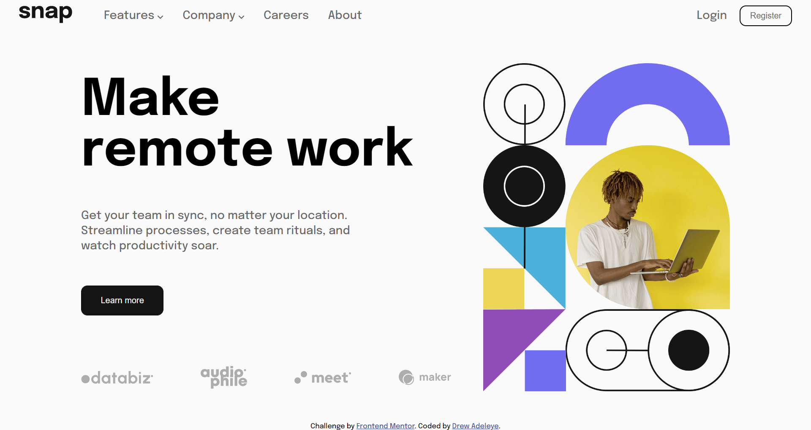

# Frontend Mentor - Intro section with dropdown navigation solution

This is a solution to the [Intro section with dropdown navigation challenge on Frontend Mentor](https://www.frontendmentor.io/challenges/intro-section-with-dropdown-navigation-ryaPetHE5). Frontend Mentor challenges help you improve your coding skills by building realistic projects.

## Table of contents

- [Overview](#overview)
  - [The challenge](#the-challenge)
  - [Screenshot](#screenshot)
  - [Links](#links)
- [My process](#my-process)
  - [Built with](#built-with)
  - [What I learned](#what-i-learned)
  - [Continued development](#continued-development)
  - [Useful resources](#useful-resources)
- [Author](#author)
- [Acknowledgments](#acknowledgments)

**Note: Delete this note and update the table of contents based on what sections you keep.**

## Overview

### The challenge

Users should be able to:

- View the relevant dropdown menus on desktop and mobile when interacting with the navigation links
- View the optimal layout for the content depending on their device's screen size
- See hover states for all interactive elements on the page

### Screenshot

### Links

- Solution URL: [Add solution URL here](https://your-solution-url.com)
- Live Site URL: [Add live site URL here](https://your-live-site-url.com)

## My process

### Built with

- Semantic HTML5 markup
- CSS custom properties
- Flexbox
- JavaScript

### What I learned

Before this project I had no idea on how to build a hamburger menu or a sidebar menu on mobile.
After taking on this project I learnt:
-How to build a hamburger menu
-How to build a dropdown menu
-How to build a sidebar menu
-Transitons and aminations

### Continued development

I took on this project to improve my javascript, and that is still my main focus. Getting better at
javascript and then moving on to learn react js

### Useful resources

- Youtube.com is always there for you anyday anytime lol

## Author

- Website - [Drew adeleye](https://www.your-site.com)
- Frontend Mentor - [@Drew-adeleye](https://www.frontendmentor.io/profile/Drew-adeleye)
- Twitter - [@\_Andrewiiii](https://www.twitter.com/_Andrewiiii)

## Acknowledgments

- [WebDevSimplified]()
